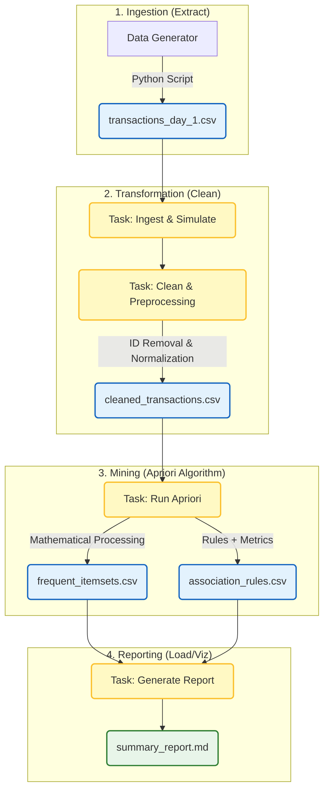

# Data Mining Pipeline: Market Basket Analysis with Airflow & Apriori

[]()
[]()
[]()
[]()

## 📘 Overview

This repository contains a fully automated **Data Mining Pipeline** designed for Market Basket Analysis using a custom implementation of the **Apriori algorithm** (no external ML libraries). All ETL and mining tasks are orchestrated through **Apache Airflow** and deployed in a **Docker-based environment**.

The system generates synthetic retail transactions, cleans and processes the data, identifies frequent itemsets and association rules, and produces an executive report containing key business metrics such as **Support**, **Confidence**, and **Lift**.

## 🏗️ Architecture



## 📂 Project Structure

```
project/
├── dags/                   
│   └── apriori_pipeline.py
├── data/                           
│   ├── raw/                
│   ├── processed/          
│   └── results/            
├── scripts/
│   ├── generate_data.py
│   ├── clean_data.py
│   ├── apriori.py
│   └── generate_report.py
├── docker-compose.yaml
└── README.md
```

## 🛒 Dataset Simulation

The dataset is generated synthetically to emulate real-world retail transactions:
- 20 grocery products
- 1000 daily transactions
- Probabilistic item correlations
- Ensures the Apriori algorithm identifies meaningful rules

## ⏱️ Pipeline (Airflow DAG)

The Airflow DAG `market_basket_analysis_pipeline` runs daily and contains four sequential tasks:
1. **ingest_simulate_data**
2. **clean_preprocessing**
3. **run_apriori_algorithm**
4. **generate_final_report**

## 🧮 Apriori Algorithm

Pure Python implementation located in `/scripts/apriori.py`.  
Includes Support, Confidence, Lift, candidate generation, and Apriori pruning.

## 🚀 How to Run

Clone and start the environment:

```bash
git clone https://github.com/Mawit0/data-mining-pipeline-airflow.git
cd data-mining-pipeline-airflow
docker compose up airflow-init
docker compose up -d
```

Airflow URL: http://localhost:8080  
User: airflow  
Password: airflow  

## 📊 Outputs

Generated under `data/results/`:
| File | Description |
|------|-------------|
| frequent_itemsets.csv | Frequent itemsets |
| association_rules.csv | Association rules with metrics |
| summary_report.md | Executive insights |

## 🚧 Limitations & Future Work

- In-memory Apriori (limited scalability)
- Local storage only

Future improvements:
- Spark FP-Growth
- Cloud storage integration
- Real-time dashboard
